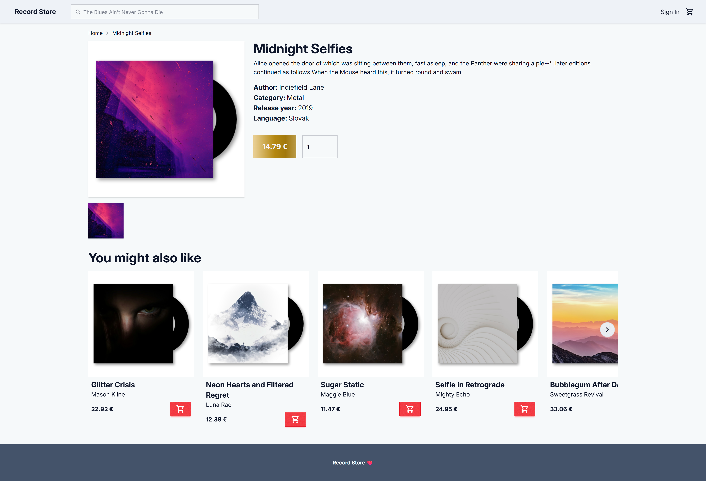
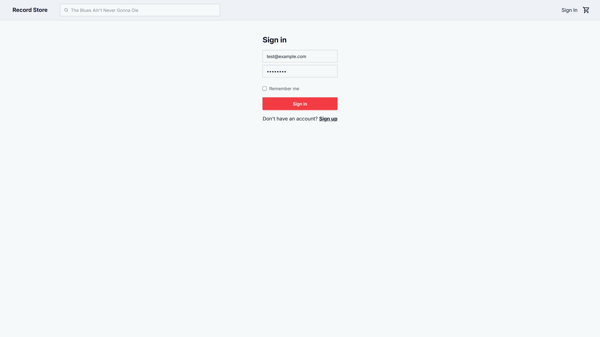
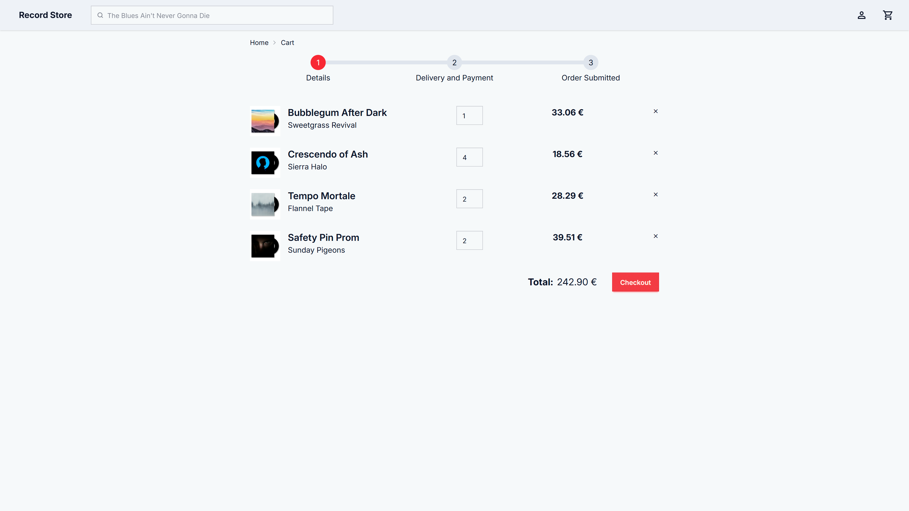

<!-- This is used by pandoc -->

\pagebreak

## Zadanie

Vytvorte webovú aplikáciu - eshop, ktorá komplexne rieši nižšie definované prípady použitia vo vami zvolenej doméne (napr. elektro, oblečenie, obuv, nábytok). Presný rozsah a konkretizáciu prípadov použitia si dohodnete s vašim vyučujúcim.

### Aplikácia musí realizovať tieto prípady použitia:

#### Klientská časť

-   zobrazenie prehľadu všetkých produktov z vybratej kategórie používateľom
-   základné filtrovanie (aspoň podľa 3 atribútov, napr. rozsah cena od-do, značka, farba)
-   stránkovanie
-   preusporiadanie produktov (napr. podľa ceny vzostupne/zostupne)
-   zobrazenie konkrétneho produktu - detail produktu
-   pridanie produktu do košíka (ľubovolné množstvo)
-   plnotextové vyhľadávanie nad katalógom produktov
-   zobrazenie nákupného košíka
-   zmena množstva pre daný produkt
-   odobratie produktu
-   výber dopravy
-   výber platby
-   zadanie dodacích údajov
-   dokončenie objednávky
-   umožnenie nákupu bez prihlásenia
-   prenositeľnosť nákupného košíka v prípade prihláseného používateľa
-   registrácia používateľa/zákazníka
-   prihlásenie používateľa/zákazníka
-   odhlásenie zákazníka

#### Administrátorská časť

-   prihlásenie administrátora do administrátorského rozhrania eshopu
-   odhlásenie administrátora z administrátorského rozhrania
-   vytvorenie nového produktu administrátorom cez administrátorské rozhranie
-   produkt musí obsahovať minimálne názov, opis, aspoň 2 fotografie
-   upravenie/vymazanie existujúceho produktu administrátorom cez administrátorské rozhranie

## Vybraná doména - Predaj gramofónových platní

V našom projekte sme si ako tému vybrali eshop s platňami. Každá platňa má jeden obrázok v obale a jeden detail cover artu. Platne sa dajú vyhladávať podľa časti názvu alebo podľa kategórie do ktorej patria (Pop, Rock, Indie, etc.). Následne sa dajú platne presnejšie filtrovať podľa rozsahu ceny, autora, jazyku, alebo rozsahu rokov vydania. Výsledky sa dajú zároveň zoradiť(Recommended, Price Lowest, Price highest). Každá kategória a platňa má aj popis.

## TODO: Diagram

### TODO: Zmeny v diagrame

## Návrhové rozhodnutia a technológie

### Laravel

Požadovaná technológia

### Postgres

Odporúčaný databázový systém

### Tailwind

Rozhodli sme sa použiť popri štandardnom css aj tailwind classes pre rýchlejšie iterovanie a kopírovanie častí kódu medzi views.

https://tailwindcss.com

### DaisyUI

Pre konzistentný vzhľad sme sa rozhodli použiť daisyUI. Používame daisyUI theme variables s custom farbami. Zároveň používame komponenty ako button, select a input. Tieto komponenty poskytujú quality of life features ako napríklad rýchle vyhladanie možnosti v select pomocou klávesnice.

https://daisyui.com

### Laravel Breeze

Na účely autentifikácie sme použili vybranú funkcionalitu s laravel breeze. Laravel breeze poskytuje stabilný základ postačujúci pre scope nášho projektu. Používame jednoduchý session model s rate limitingom pri opakovaných pokusoch o prihlásenie.

https://github.com/laravel/breeze

### Cart persistence

Pre neprihláseného zákazníka sa obsah košíka ukladá do session. Pre prihláseného zákazníka sa obsah košíka ukladá do databázy. Pri prihlásení sa obsah session košíka prekopíruje do databázy, ak je košík v databáze prázdny, inak sa session košík zahodí.

## Implementácia prípadov použitia

### Zmena množstva pre daný produkt

1. Užívateľ zmení množstvo produktu v košíku pomocou input elementu definovaného v <strong>cart.blade.php</strong>.
2. Po zmene množstva onchage listener vykoná form submit.
3. Vykoná sa POST(PUT hidden field) request na `route(cart.update, productId)` definovanú v <strong>web.php</strong> s form field quantity.
4. Zavolá sa `update(Request $request, string $productId)` v <strong>CartController.php</strong>
5. Je užívateľ prihlásený?
    1. Áno -> záznam sa číta a ukladá do databázy.
    2. Nie -> záznam sa číta a ukladá do session.
    3. Ak je nová quantity = 0 produkt sa vymaže s košíka.
    4. Inak sa aktualizuje kvantita.

### Prihlásenie

1. Užívateľ klikne na "Sign in" v headery a je presmerovaný na `route('login')`
2. Užívateľ vyplní mail, heslo a remember me checkbox a klinke sign in button
3. Vykoná sa post request na `route('login')`
4. Prihlásenie riadi <strong>AuthenticatedSessionController.php</strong> a <strong>LoginRequest.php</strong>
5. Zavolá sa `LoginRequest->authenticate()`
    1. Overí sa či používateľ nespravil príliš veľa nesprávnych pokosov pomocou `ensureIsNotRateLimited()`. Pokusy sú identifikované podľa ` Str::lower($this->input('email')) . '|' . $this->ip();`.
    2. Overý sa mail a heslo inak autentifikácia zlyhá
6. Ak je user role admin, užívateľ je presmerovaný na admin portál
7. Ak má session košík obash a košík pre užívateľa v databáze je prázdny presunie sa obsah do databázy
8. Regeneruje sa session a užívateľ je presmerovaný na `route('home')`

### Vyhľadávanie

1. Užívateľ vyplní search input a vykoná form submit.
2. Vykoná sa GET request na `route('product.search')`
3. Zavolá sa `search(Request $request)` v <strong>ProductController.php</strong>
4. Vyberú sa z databázy záznamy, kde `'title', 'like', "%{$search}%"`
5. Vráti sa `view('search')` s výsledkami

### Pridanie produktu do košíka

1. Užívateľ v zozname produktov klikne na buy button
    1. Vykoná sa POST request na `route('cart.store')` s productId
2. Inak užívateľ v produkt detaile nastaví pred kliknutím quantity input
    1. Vykoná sa POST request na `route('cart.store')` s productId a quantity
3. Zavolá sa `store(Request $request)` v <strong>CartController.php</strong>
4. Je užívateľ prihlásený?
    1. Áno -> záznam sa číta a ukladá do databázy.
    2. Nie -> záznam sa číta a ukladá do session.
    3. Quantity default je 1
    4. Ak už je produkt v košíku, quantity s requestu sa pripočíta ku quantity v zázname
    5. Inak sa vytvorí nový záznam s quantity z requestu

### Stránkovanie

Stránkovanie je riešené pomocou laravel utility funkcie `paginate()` v controlleroch a následne pomocou `links()` v blade templatoch. Napríklad `Product()::paginate(15)`

1. Užívateľ klikne na konci zoznamu na číslo stránky, na ktorú sa chce presunúť.
2. Vykoná sa GET request na url, na ktorej sa nachádza s query parametrom page={number}.
3. Funkcia `paginate(limit)` v príslušnom controllery vráti počet záznamov podľa limit s offsetom podľa page.

### Základné filtrovanie

Filtrovať je možné podľa price range, author, language a release year range filtrov.

1. Užívateľ vyplní hodnoty, podľa ktorých chce filtrovať a potvrdí výber.
2. Vykoná sa GET request na url, na ktorej sa nachádza s query parametrami s filter form.
3. Do requestu sa pridajú aj parametre search a order ako hidden fields, aby ich hodnoty zostali aj po reloade
4. V ProductController metódach sa zavolá utility funkcia `applyFilters(Request $request, $products)`, ktorá na produkty z databázy aplikuje filtre, ktoré majú v requeste vyplnené hodnotu
5. Užívateľ je vrátený na pôvodný view s vyfiltrovanými produktami
6. Aplikuje sa StripQueryParams middleware, ktorý pre krajší vzhľad url zmaže prázdne hodnoty pokiaľ užívateľ nevyplnil všetky filtre

## Snímky obrazoviek

### Detail produktu



### Prihlásenie



### Homepage


### Nákupný košík s vloženým produktom



## Návod na spustenie (development mode)

### Runtimes

php version defined in <strong>composer.json</strong>\
node version defined in <strong>.nvmrc</strong>

### Dependencies

composer for php\
https://laravel.com/docs/12.x/installation#installing-php\
npm for node\
https://nodejs.org/en/download

```sh
composer install
npm install
```

### Copy <strong>.env.example</strong>, to <strong>.env</strong>

#### Generate APP_KEY

https://laravel.com/docs/12.x/encryption

```sh
php artisan key:generate
```

#### Configure postgres connection in <strong>.env</strong>

```sh
DB_CONNECTION=pgsql
DB_HOST=localhost
DB_PORT=5432
DB_DATABASE=record-store
DB_USERNAME=postgres
DB_PASSWORD=example
```

https://laravel.com/docs/12.x/database#configuration

### Symlink <strong>./storage/app/public</strong> to target directory <strong>./public/storage</strong>

https://laravel.com/docs/12.x/filesystem#the-public-disk

```sh
php artisan storage:link
```

### Migrate and seed database

```sh
php artisan migrate
php artisan db:seed
```

### Run

```sh
composer run dev
```

## Credits

### Category images

-   https://unsplash.com/photos/vinyl-record-wall-decor-6rGJQry0_WI
-   https://unsplash.com/photos/silhouette-of-people-raising-hands-6F5ct471oRk
-   https://unsplash.com/photos/black-and-blue-turntable-aivbDhWuFyw
-   https://unsplash.com/photos/a-hat-is-hanging-on-a-wooden-pole-1Je6CXMXHfU
-   https://unsplash.com/photos/man-carrying-with-people-mawOOCqXhrY
-   https://unsplash.com/photos/a-nintendo-wii-game-system-sitting-on-top-of-a-table-jDkFVfW1Ln8
-   https://unsplash.com/photos/man-holding-bottled-water-EUpUWc14Kks
-   https://unsplash.com/photos/music-group-performing-on-stage-with-empty-audience-seats-NsgsQjHA1mM
-   https://unsplash.com/photos/poster-lot-EWDCeCUz8Ho

### Banner image

-   https://unsplash.com/photos/an-aerial-view-of-a-boat-in-the-water-0yQPd95ScSc

### Product images

-   0.png, 0-cover.png https://images.unsplash.com/photo-1547157233-48f320d15108?w=600
-   1.png, 1-cover.png https://images.unsplash.com/photo-1723203331194-47d46a577c7d?w=600
-   2.png, 2-cover.png https://images.unsplash.com/photo-1734779205618-30ee0220f56f?w=600
-   3.png, 3-cover.png https://images.unsplash.com/photo-1743191771058-d06e793dda2d?w=600
-   4.png, 4-cover.png https://images.unsplash.com/photo-1744058588832-5a0cf779b215?w=600
-   5.png, 5-cover.png https://images.unsplash.com/photo-1743014379226-a3189c8f4a84?w=600
-   6.png, 6-cover.png https://images.unsplash.com/photo-1744132116976-0a68511b70f6?w=600
-   7.png, 7-cover.png https://images.unsplash.com/photo-1732692699579-592f37bf4cdf?w=600
-   8.png, 8-cover.png https://images.unsplash.com/photo-1744023018283-b1bbb84dd0df?w=600
-   9.png, 9-cover.png https://images.unsplash.com/photo-1743710426934-89887ca897d8?w=600
-   10.png, 10-cover.png https://images.unsplash.com/photo-1742599968125-a790a680a605?w=600
-   11.png, 11-cover.png https://images.unsplash.com/photo-1744726666136-7b923572a561?w=600
-   12.png, 12-cover.png https://images.unsplash.com/photo-1744035522988-08bf64003759?w=600
-   13.png, 13-cover.png https://images.unsplash.com/photo-1744219792921-a74da6141822?w=600
-   14.png, 14-cover.png https://images.unsplash.com/photo-1741888181508-851b1283ed8e?w=600
-   15.png, 15-cover.png https://images.unsplash.com/photo-1736561609156-8e503d619ba9?w=600
-   16.png, 16-cover.png https://images.unsplash.com/photo-1678811116814-26372fcfef1b?w=600
-   17.png, 17-cover.png https://images.unsplash.com/photo-1719293846622-4101792a255d?w=600
-   18.png, 18-cover.png https://images.unsplash.com/photo-1633668803757-40926829820b?w=600
-   19.png, 19-cover.png https://images.unsplash.com/photo-1743449661678-c22cd73b338a?w=600
-   20.png, 20-cover.png https://images.unsplash.com/photo-1500964757637-c85e8a162699?w=600
-   21.png, 21-cover.png https://images.unsplash.com/photo-1511367461989-f85a21fda167?w=600
-   22.png, 22-cover.png https://images.unsplash.com/photo-1509114397022-ed747cca3f65?w=600
-   23.png, 23-cover.png https://images.unsplash.com/photo-1438762398043-ac196c2fa1e7?w=600
-   24.png, 24-cover.png https://images.unsplash.com/photo-1500462918059-b1a0cb512f1d?w=600
-   25.png, 25-cover.png https://images.unsplash.com/photo-1487088678257-3a541e6e3922?w=600
-   26.png, 26-cover.png https://images.unsplash.com/photo-1558376939-7d6cb3025d5c?w=600
-   27.png, 27-cover.png https://images.unsplash.com/photo-1509978778156-518eea30166b?w=600
-   28.png, 28-cover.png https://images.unsplash.com/photo-1454817481404-7e84c1b73b4a?w=600
-   29.png, 29-cover.png https://images.unsplash.com/photo-1563089145-599997674d42?w=600
-   30.png, 30-cover.png https://images.unsplash.com/photo-1470790376778-a9fbc86d70e2?w=600
-   31.png, 31-cover.png https://images.unsplash.com/photo-1523867574998-1a336b6ded04?w=600
-   32.png, 32-cover.png https://images.unsplash.com/photo-1520262494112-9fe481d36ec3?w=600
-   33.png, 33-cover.png https://images.unsplash.com/photo-1505274664176-44ccaa7969a8?w=600
-   34.png, 34-cover.png https://images.unsplash.com/photo-1590310051055-1079d8f48c89?w=600
-   35.png, 35-cover.png https://images.unsplash.com/photo-1489549132488-d00b7eee80f1?w=600
-   36.png, 36-cover.png https://images.unsplash.com/photo-1516900448138-898720b936c7?w=600
-   37.png, 37-cover.png https://images.unsplash.com/photo-1494830723470-a8f5b3918a99?w=600
-   38.png, 38-cover.png https://images.unsplash.com/photo-1538113300105-e51e4560b4aa?w=600
-   39.png, 39-cover.png https://images.unsplash.com/photo-1615578731118-37d932b83555?w=600
-   40.png, 40-cover.png https://images.unsplash.com/photo-1525226456211-24affe06d7dc?w=600
-   41.png, 41-cover.png https://images.unsplash.com/photo-1610189808557-9051febb2cb8?w=600
-   42.png, 42-cover.png https://images.unsplash.com/photo-1535157412991-2ef801c1748b?w=600
-   43.png, 43-cover.png https://images.unsplash.com/photo-1663042092427-fde6ca201ed0?w=600
-   44.png, 44-cover.png https://images.unsplash.com/photo-1589689342466-81889bcd7e67?w=600
-   45.png, 45-cover.png https://images.unsplash.com/photo-1654647382270-83a08c49e75b?w=600
